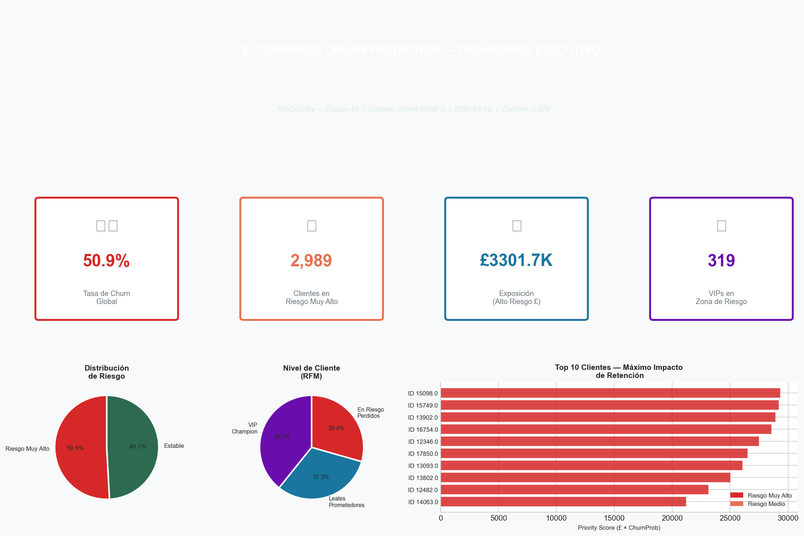

# 💎 E-commerce Churn Intelligence - Enterprise Pipeline

[](https://github.com/)
[](https://supabase.com/)
[](https://powerbi.microsoft.com/)

> **Proyecto Estratégico de Predicción de Abandono (Churn) mediante Inteligencia Artificial y Arquitectura Modular.**

---

## 📊 1. El Impacto (Executive Dashboard)
Hemos diseñado un ecosistema de 6 páginas en Power BI conectado vía **Session Pooling** a Supabase, permitiendo una visualización en tiempo real del riesgo monetario.



---

## ⚙️ 2. Arquitectura Técnica (The Engine)
El proyecto utiliza una arquitectura de **3 Capas (Bronze, Silver, Gold)**:

1.  **Ingesta & Validación:** Limpieza de 1M+ de transacciones y validación de tipos de datos.
2.  **Feature Engineering:** Creación de métricas RFM (Recency, Frequency, Monetary) y escalado dinámico.
3.  **IA Core:** Entrenamiento de modelos XGBoost con búsqueda de hiperparámetros y explicabilidad vía **SHAP**.
4.  **Exportación Cloud:** Sincronización automática a Supabase con RLS (Row Level Security) activo.

---

## 🛠️ 3. Stack Tecnológico
*   **Lenguaje:** Python 3.11
*   **Modelado:** Scikit-Learn, XGBoost, SHAP
*   **Base de Datos:** PostgreSQL (Supabase Cloud)
*   **BI:** Power BI Desktop / Service (PBIP Format)
*   **Versionamiento:** Git / GitHub

---

## 📂 4. Estructura del Proyecto
```bash
├── config/             # Configuración centralizada (YAML)
├── data/               # RAW, Intermedio y Exports (CSV/Parquet)
├── Dashboard/          # Proyecto Power BI (.pbip) con 6 páginas
├── notebooks/          # EDA y Modelado (Visión Senior)
├── pipelines/          # Orquestadores E2E (Run All)
├── sql/                # Schemas, Vistas y Seguridad (Supabase)
└── src/                # Lógica modular (SOLID Principles)
```

---

## 🚀 5. Cómo Ejecutar (Quick Start)
Para actualizar todo el ecosistema con datos nuevos:
```bash
# 1. Instalar dependencias
pip install -r requirements.txt

# 2. Correr el Pipeline Maestro
python pipelines/run_full_pipeline.py
```

---

**Desarrollado con ❤️ por el Equipo 40 - No Country Simulation.** 
*Nivel de Calidad: Senior / Enterprise.*